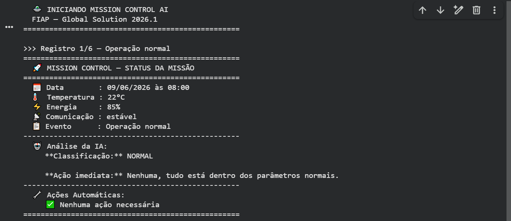
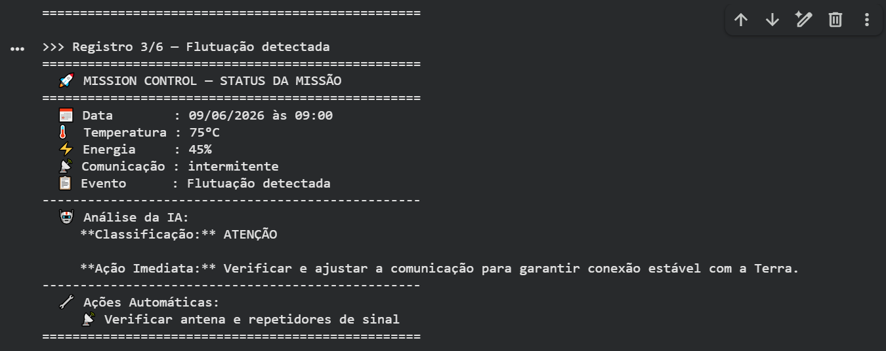
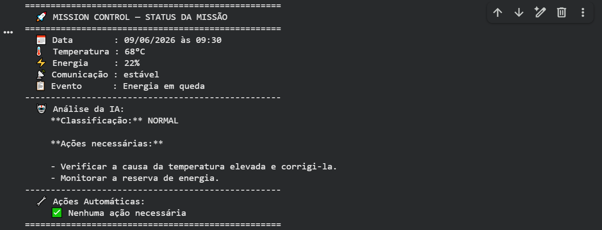
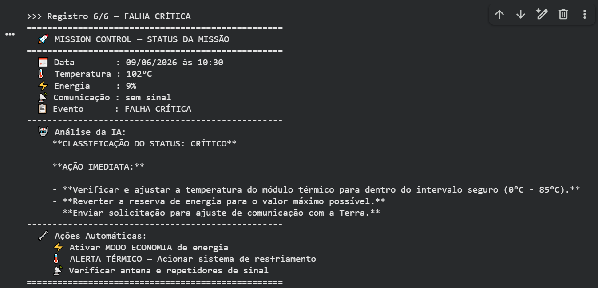

# 🚀 Mission Control AI

**FIAP — Global Solution 2026.1**
Disciplina: Prompt and Artificial Intelligence

**Integrantes:**
- Arthur Micarelli — RM: 571476
- Enzo Yudi Hino — RM: 570173
- Inaldo Pereira — RM: 569672


---

## Descrição do Projeto

O projeto nomeado de **Mission Control AI** é um sistema inteligente de monitoramento para controle básico de uma "missão espacial" experimental, desenvolvido como solução para o Global Solution 2026.1 da FIAP.

O sistema coleta dados operacionais simulados de uma nave espacial — temperatura dos módulos, reserva de energia e status de comunicação — e os submete a um modelo de linguagem (Llama 3.2 3B via Ollama) que atua como analista de bordo. Com base na resposta da IA e em regras lógicas definidas em código, o sistema classifica cada situação como **NORMAL**, **ATENÇÃO** ou **CRÍTICO** e emite as ações corretivas correspondentes.

---

## Como a IA está envolvida

O modelo **Llama 3.2 3B**, executado localmente via **Ollama**, recebe a cada ciclo os dados de telemetria da nave (temperatura, energia e comunicação) e retorna uma análise técnica com classificação de status e ação imediata recomendada. O system prompt foi calibrado para limitar o contexto à missão espacial, garantindo respostas objetivas e relevantes ao cenário simulado.

É interessante acrescentar que outros modelos foram testados além do escolhido, o **Llama 3.2 3B**. Entre eles estavam o **Llama 3.2 1B** e o **Qwen3:4B**, que não passaram nos testes: o primeiro por ser muito “fraco” e não conseguir conectar corretamente o contexto do prompt com os dados, e o segundo por ser muito pesado, tornando suas respostas excessivamente demoradas.

---

## Demonstração

**Cenário 1 — Operação Normal**



**Cenário 2 — Flutuação Detectada (Atenção)**



**Cenário 3 — Energia em Queda (Atenção)**



**Cenário 4 — Alerta Crítico / Falha Crítica**



---

## Tecnologias Utilizadas

| Tecnologia | Finalidade |
|---|---|
| Python 3 | Linguagem principal do projeto |
| Google Colab | Ambiente de execução em nuvem |
| Ollama | Servidor local de modelos de linguagem |
| Llama 3.2 3B | Modelo de IA generativa para análise da missão |
| Biblioteca `ollama` (pip) | Interface Python para comunicação com o modelo |
| `datetime` (stdlib) | Geração de timestamps nos dados simulados |

---

## Como Executar

O projeto roda 100% no Google Colab, sem instalação local.

**Acesse o notebook:**
[🔗 Abra o Notebook no Google Colab](https://colab.research.google.com)

Execute as células em ordem. O Ollama e o modelo Llama 3.2 3B são instalados automaticamente nas primeiras células.

**Resumo das etapas executadas pelo notebook:**

1. Instalação do Ollama via script oficial
2. Inicialização do servidor Ollama em background
3. Download do modelo `llama3.2:3b`
4. Instalação da biblioteca Python `ollama`
5. Execução do sistema: geração dos dados → análise pela IA → exibição dos resultados

---

## Estrutura do Código

O código está organizado em três partes bem definidas:

**Parte 1 — Agente:** define o system prompt com contexto da missão e a função `consultar_agente()`, responsável por enviar os dados ao modelo Llama e retornar a análise.

**Parte 2 — Geração de Dados Simulados:** função `gerar_dados_missao()` que produz 6 registros cobrindo os cenários normal, atenção e crítico, com data e hora simuladas.

**Parte 3 — Testes e Saída:** funções `aplicar_regras()` e `exibir_status()` que aplicam a lógica de decisão automática (limiares de energia, temperatura e comunicação) e imprimem os resultados de forma organizada no terminal.

---

## Lógica de Alertas Automáticos

| Condição | Ação Automática |
|---|---|
| Energia < 20% | ⚡ Ativar MODO ECONOMIA de energia |
| Temperatura > 90°C | 🌡️ ALERTA TÉRMICO — Acionar sistema de resfriamento |
| Comunicação instável / intermitente / sem sinal | 📡 Verificar antena e repetidores de sinal |

---

## Vídeo de Demonstração

[▶️ Assistir ao vídeo](https://link-do-video.com)

---

## 📁 Organização do Repositório

```
mission-control-ai/
├── mission_control_ai.ipynb   # Notebook principal
├── README.md                  # Este arquivo
└──                            # Prints do sistema funcionando
    ├── print_normal.png
    ├── print_atencao.png
    ├── print_energia.png
    └── print_critico.png
```
